# Mosaical MVP - Decentralized NFT Fractionalization Platform

Mosaical là một nền tảng phi tập trung cho phép phân mảnh (fractionalize) NFT và tạo ra các token DPO (Diversified Portfolio Option) để giao dịch và đầu tư vào danh mục NFT đa dạng.

## 📋 Todo List

### ✅ Completed
- [x] Smart contract development (8 contracts)
- [x] Contract compilation system
- [x] Deployment scripts for Saga chainlet
- [x] Contract flattening for verification
- [x] Basic testing framework
- [x] Environment configuration
- [x] Contract verification on Saga Explorer

### 🔧 In Progress
- [ ] Frontend development
- [ ] API integration
- [ ] Advanced testing scenarios

### 📅 Planned
- [ ] Oracle price feed integration
- [ ] Cross-chain bridge functionality
- [ ] Governance voting mechanism
- [ ] Staking rewards system
- [ ] Mobile application
- [ ] Audit and security review

## 🏗️ System Architecture

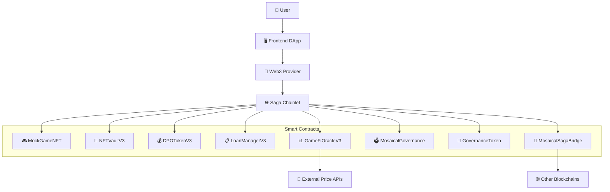

## 🎯 Core Features

### 1. NFT Fractionalization
- Deposit NFTs vào vault để nhận DPO tokens
- Phân mảnh ownership của high-value NFTs
- Liquidity mining và yield farming

### 2. Decentralized Finance (DeFi)
- Lending/borrowing với NFT collateral
- Interest distribution system
- Order book trading cho DPO tokens

### 3. Governance System
- Community voting trên protocol changes
- Proposal creation và execution
- Token-based voting power

### 4. Cross-chain Bridge
- Transfer assets giữa các chains
- Multi-chain NFT support
- Unified liquidity pools

## 📊 Functional Diagram

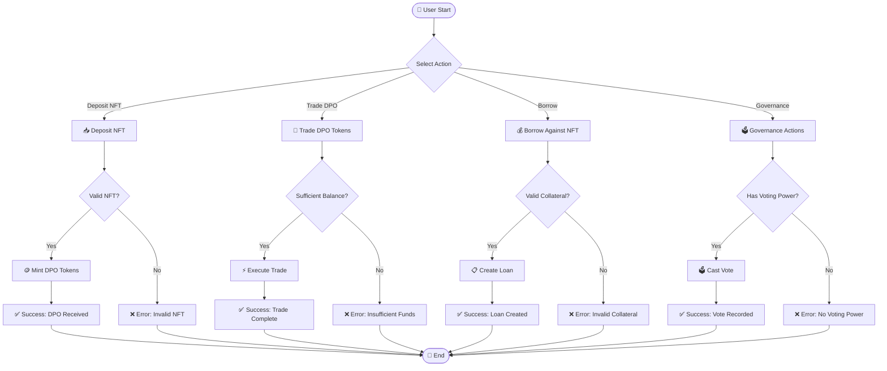

## 🎭 Use Case Diagram

### System Level Use Cases

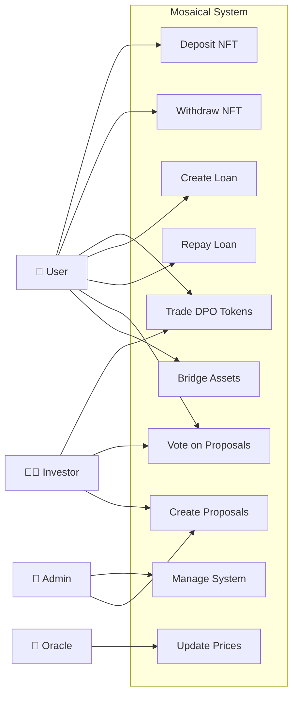

### NFT Vault Module Use Cases

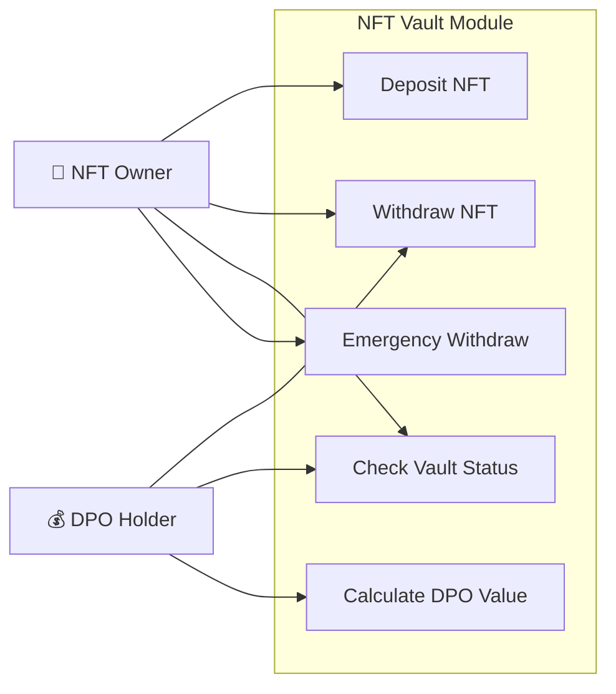

### Loan Manager Module Use Cases

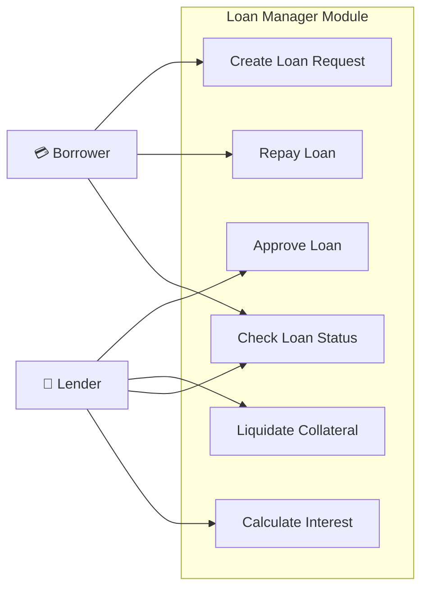

### Governance Module Use Cases

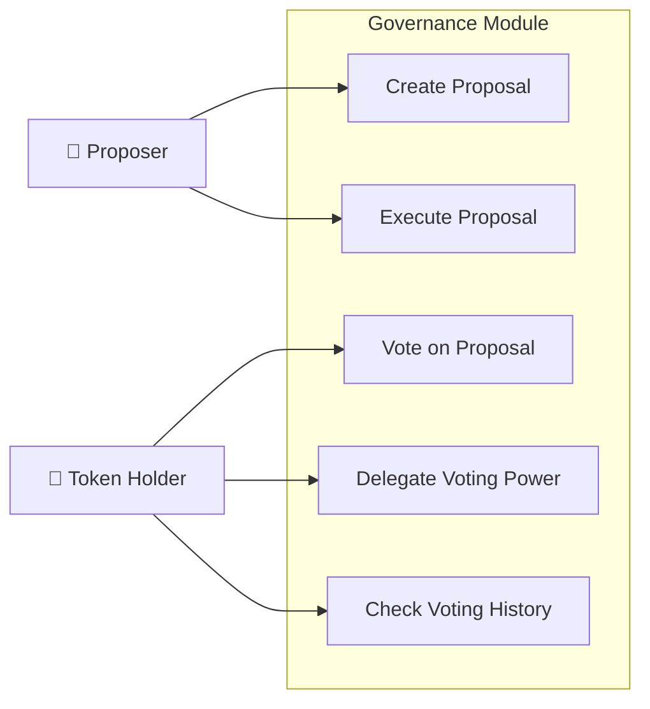

## 🏛️ Class Diagram

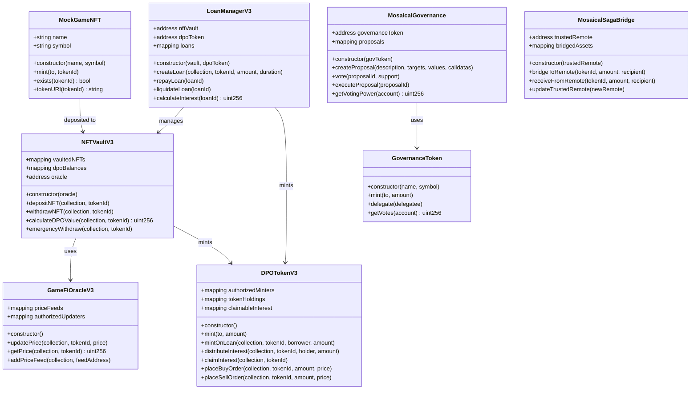

## 📊 Entity Relationship Diagram

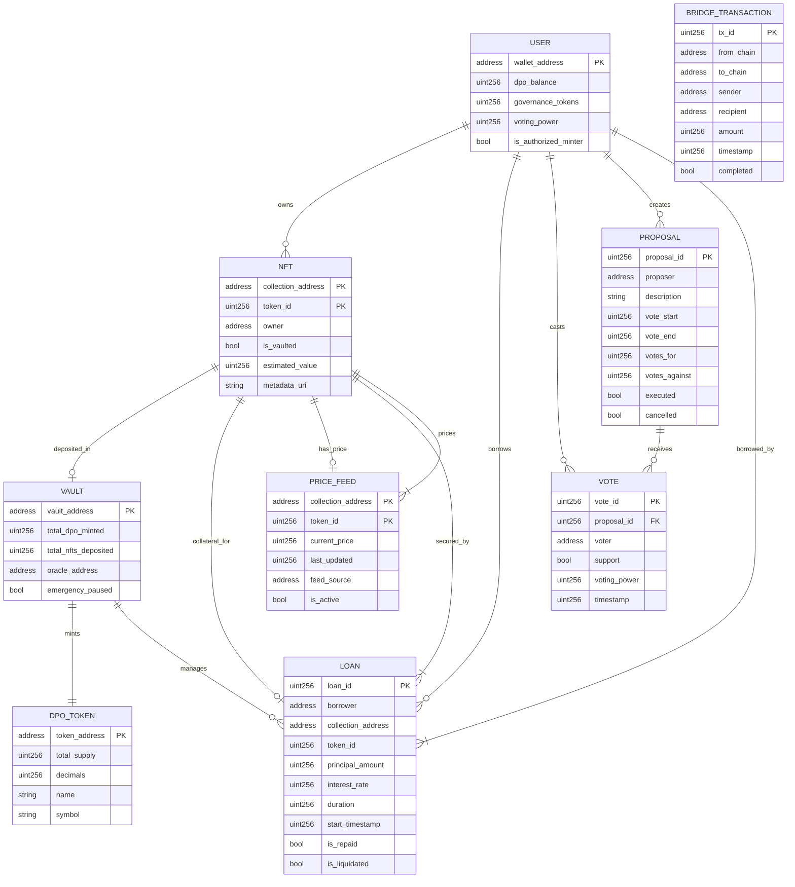

## 🚀 Quick Start

### 1. Environment Setup
```bash
# Copy environment template
cp .env.example .env

# Edit .env with your private key and network settings
```

### 2. Compile Contracts
```bash
# Using workflow button or command
npm run compile
# or
node scripts/compile.js
```

### 3. Deploy Contracts
```bash
# Deploy to Saga chainlet
npx hardhat run scripts/deploy.js --network devpros

# Deploy with JSON output
npx hardhat run scripts/deploy-with-json.js --network devpros
```

### 4. Verify Contracts
```bash
# Flatten contracts first
node scripts/flatten.js

# Manual verification on Saga Explorer
# Use flattened files in /flattened directory
```

### 5. Run Tests
```bash
npx hardhat test
```

## 📁 Project Structure

```
├── contracts/              # Smart contracts
│   ├── MockGameNFT.sol     # Example NFT contract
│   ├── NFTVaultV3.sol      # NFT vault for deposits
│   ├── DPOTokenV3.sol      # Fractionalized tokens
│   ├── LoanManagerV3.sol   # Lending protocol
│   ├── GameFiOracleV3.sol  # Price oracle
│   ├── MosaicalGovernance.sol # DAO governance
│   ├── GovernanceToken.sol # Voting tokens
│   └── MosaicalSagaBridge.sol # Cross-chain bridge
├── scripts/                # Deployment & utility scripts
├── test/                   # Test files
├── deployments/            # Deployment records
├── flattened/              # Flattened contracts for verification
└── .env.example           # Environment template
```

## 🌐 Network Configuration

### Saga Chainlet (devpros)
- **RPC URL**: `https://devpros-2749656616387000-1.jsonrpc.sagarpc.io`
- **Chain ID**: `2749656616387000`
- **Explorer**: `https://devpros-2749656616387000-1.sagaexplorer.io`
- **WebSocket**: `https://devpros-2749656616387000-1.ws.sagarpc.io`

### Contract Addresses (Latest Deployment)
```json
{
  "MockGameNFT": "0x165ABbf7859997e9Ebed825df101E313Db642dda",
  "GovernanceToken": "0x54bef235A25daC5B4386A05e25D37688C5379936",
  "GameFiOracleV3": "0x980F5eA0dc03175056BC041f4708C82B74d6E322",
  "NFTVaultV3": "0x869d9bF00823018f74854033040943A1ff5EFf60",
  "MosaicalGovernance": "0xd31E3D5e43E9945B4AF2aDD7f5a54C00E76b0991",
  "DPOTokenV3": "0x6d66483DC259783f4E4aDe90b1fAB01F8A876D2e",
  "LoanManagerV3": "0xC9D80AF77a91d7FB7A73189D1D97ABc29399460c",
  "MosaicalSagaBridge": "0x2FbA9CcF4930FB188a4A5A7a7bFC6aDBda0eb439"
}
```

## 🔧 Available Scripts

| Command | Description |
|---------|-------------|
| `npm run compile` | Compile smart contracts |
| `npm run deploy` | Deploy contracts to network |
| `npm run test` | Run test suite |
| `npm run flatten` | Generate flattened contracts |
| `npm run verify` | Verify contracts on explorer |

## 🛡️ Security Considerations

- All contracts use OpenZeppelin secure implementations
- Multi-signature requirements for critical operations
- Emergency pause mechanisms
- Oracle price manipulation protection
- Reentrancy guards on financial functions

## 📄 License

This project is licensed under the MIT License - see the [LICENSE](LICENSE) file for details.

## 🤝 Contributing

1. Fork the repository
2. Create your feature branch (`git checkout -b feature/AmazingFeature`)
3. Commit your changes (`git commit -m 'Add some AmazingFeature'`)
4. Push to the branch (`git push origin feature/AmazingFeature`)
5. Open a Pull Request

## 📞 Support

For support and questions:
- Create an issue in the repository
- Join our Discord community
- Follow our documentation

---

*Built with ❤️ on Saga Chainlet*


# 🎨 Mosaical - NFT Lending Platform

## 📋 Overview

Mosaical is a decentralized NFT lending platform that allows users to use their NFTs as collateral to borrow DPSV tokens. The platform integrates AI-powered price prediction, real-time analytics, and DPO (Decentralized Public Offering) features.

## ✨ Features

- **NFT Vault Management**: Deposit and manage NFT collections as collateral
- **Lending & Borrowing**: Borrow DPSV tokens against NFT collateral
- **AI Price Prediction**: Machine learning models for NFT price forecasting
- **Real-time Analytics**: Market data visualization and portfolio tracking
- **DPO Panel**: Decentralized public offering management
- **Multi-language Support**: English and Vietnamese language support
- **Web3 Integration**: MetaMask and wallet connectivity

## 🏗️ System Architecture

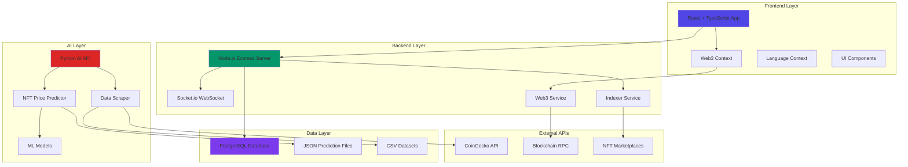

## 🎯 Use Case Diagram - Overall System

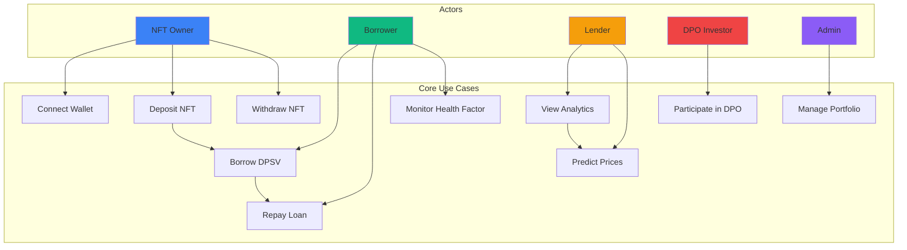

## 🏛️ Module Use Case Diagrams

### NFT Vault Module

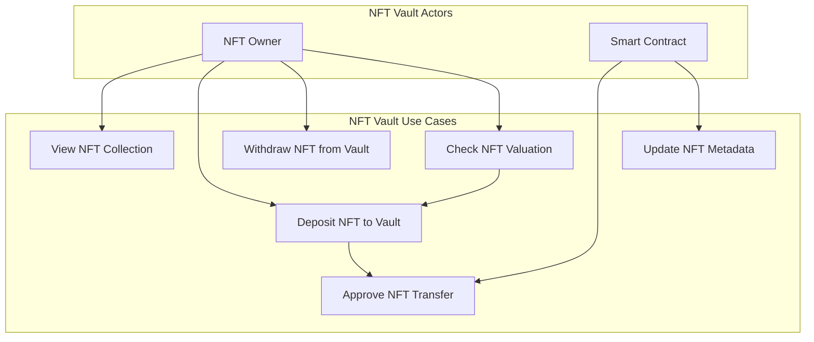

### Lending Module

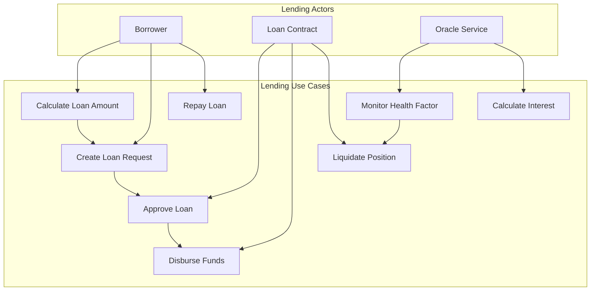

### AI Prediction Module

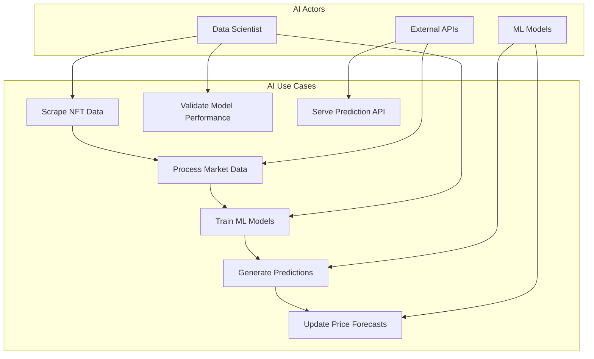

## 🎨 Class Diagram

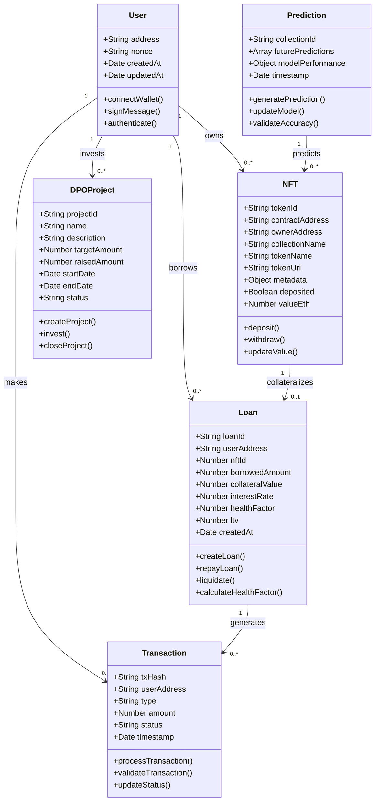

## 🗃️ Entity Relationship Diagram

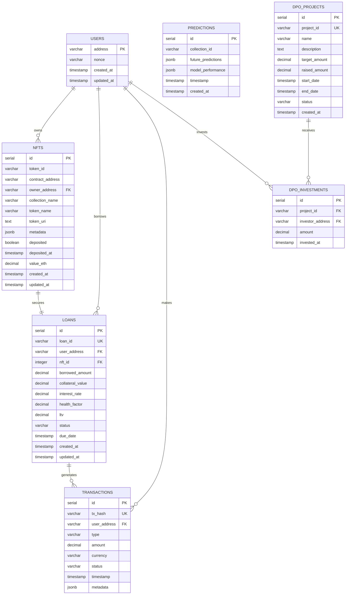

## 🔄 Functional Flow Diagram

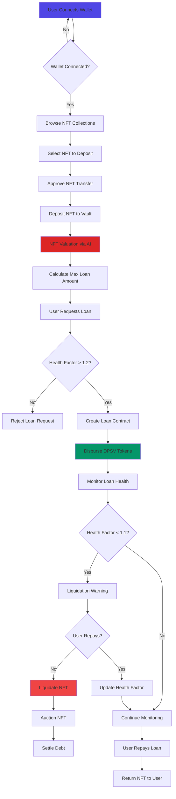

## 📊 Data Flow Diagram

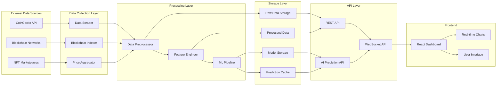

## 🏃‍♂️ Getting Started

### Prerequisites

- Node.js 18+
- Python 3.11+
- PostgreSQL 16+
- Git

### Installation

1. **Clone the repository:**
```bash
git clone <repository-url>
cd mosaical-nft-lending
```

2. **Install frontend dependencies:**
```bash
npm install
```

3. **Install backend dependencies:**
```bash
cd backend
npm install
cd ..
```

4. **Install AI dependencies:**
```bash
cd ai
pip install -r requirements.txt
cd ..
```

5. **Setup environment variables:**
```bash
cp backend/.env.example backend/.env
# Edit backend/.env with your configuration
```

6. **Setup database:**
```bash
cd backend
npm run migrate
cd ..
```

### Running the Application

**Development Mode (Full Stack + AI):**
```bash
npm run dev
```

This will start:
- Frontend on port 3001
- Backend API on port 3001
- AI API on port 5000

## 🚀 Deployment

The application is configured for Replit deployment:

1. **Build the application:**
```bash
npm run build
```

2. **Deploy via Replit:**
- Click the "Deploy" button in Replit
- Configure environment variables
- Deploy to autoscale

## 📁 Project Structure

```
mosaical-nft-lending/
├── src/                    # Frontend React application
│   ├── components/         # Reusable UI components
│   ├── contexts/          # React contexts (Web3, Language)
│   ├── pages/             # Main application pages
│   └── lib/               # Utility functions
├── backend/               # Node.js backend API
│   ├── routes/            # API route handlers
│   ├── services/          # Business logic services
│   ├── config/            # Configuration files
│   └── utils/             # Backend utilities
├── ai/                    # Python AI/ML services
│   ├── datasets/          # Training data
│   ├── models/            # Trained ML models
│   └── predictions/       # Generated predictions
└── docs/                  # Documentation
```

## 🔧 API Endpoints

### Authentication
- `POST /api/auth/login` - Web3 authentication
- `POST /api/auth/nonce` - Get nonce for signing

### User Management
- `GET /api/user/profile` - Get user profile
- `PUT /api/user/profile` - Update user profile
- `GET /api/user/balance` - Get DPSV balance

### NFT Operations
- `GET /api/nfts` - List user NFTs
- `POST /api/nfts/deposit` - Deposit NFT
- `POST /api/nfts/withdraw` - Withdraw NFT
- `GET /api/nfts/valuation/:id` - Get NFT valuation

### Lending
- `POST /api/loans/create` - Create new loan
- `GET /api/loans` - List user loans
- `POST /api/loans/repay` - Repay loan
- `GET /api/loans/health/:id` - Check health factor

### Analytics
- `GET /api/analytics/dashboard` - Dashboard metrics
- `GET /api/analytics/portfolio` - Portfolio analytics
- `GET /api/analytics/market` - Market data

### AI Predictions
- `GET /api/predictions/:collection` - Get price predictions
- `GET /api/predictions/all` - Get all predictions
- `POST /api/predictions/refresh` - Refresh predictions

## 🧪 Testing

```bash
# Run frontend tests
npm test

# Run backend tests
cd backend
npm test

# Run AI model tests
cd ai
python -m pytest tests/
```

## 📋 TODO List

### ✅ Completed Features
- [x] Basic React frontend with TypeScript
- [x] Web3 wallet integration (MetaMask)
- [x] Multi-language support (EN/VI)
- [x] NFT vault interface
- [x] Loan management interface
- [x] AI price prediction integration
- [x] Real-time analytics dashboard
- [x] DPO panel interface
- [x] Backend API with Express.js
- [x] PostgreSQL database integration
- [x] AI/ML price prediction models
- [x] CoinGecko API integration
- [x] Socket.io for real-time updates
- [x] DPSV token conversion

### 🚧 In Progress
- [ ] Smart contract integration
- [ ] Blockchain transaction processing
- [ ] Advanced ML model optimization
- [ ] Mobile responsive design improvements

### 📅 Planned Features

#### Phase 1: Core Infrastructure
- [ ] Smart contract deployment on Saga
- [ ] Automated liquidation system
- [ ] Advanced portfolio analytics
- [ ] Mobile app development

#### Phase 2: Advanced Features
- [ ] Cross-chain NFT support
- [ ] Yield farming integration
- [ ] DAO governance implementation
- [ ] Advanced trading features

#### Phase 3: Enterprise Features
- [ ] Institutional lending
- [ ] Insurance protocol integration
- [ ] Advanced risk management
- [ ] Regulatory compliance tools

#### Phase 4: Ecosystem Expansion
- [ ] NFT marketplace integration
- [ ] DeFi protocol partnerships
- [ ] Layer 2 scaling solutions
- [ ] Cross-platform compatibility

### 🐛 Known Issues
- [ ] Price prediction accuracy needs improvement
- [ ] UI responsiveness on mobile devices
- [ ] Socket.io connection stability
- [ ] Database query optimization needed

### 🔧 Technical Improvements
- [ ] Add comprehensive error handling
- [ ] Implement rate limiting
- [ ] Add API documentation with Swagger
- [ ] Improve test coverage (target: 80%+)
- [ ] Add performance monitoring
- [ ] Implement caching strategy
- [ ] Add CI/CD pipeline
- [ ] Security audit and penetration testing

### 🎨 UI/UX Improvements
- [ ] Dark/light theme toggle
- [ ] Improved loading states
- [ ] Better error messages
- [ ] Accessibility improvements
- [ ] Animation and micro-interactions
- [ ] Mobile-first responsive design

## 🤝 Contributing

1. Fork the repository
2. Create your feature branch (`git checkout -b feature/AmazingFeature`)
3. Commit your changes (`git commit -m 'Add some AmazingFeature'`)
4. Push to the branch (`git push origin feature/AmazingFeature`)
5. Open a Pull Request

## 📄 License

This project is licensed under the MIT License - see the [LICENSE](LICENSE) file for details.

## 🆘 Support

For support and questions:
- Create an issue on GitHub
- Join our Discord community
- Email: support@mosaical.io

## 🙏 Acknowledgments

- CoinGecko for NFT market data
- Saga blockchain for infrastructure
- OpenZeppelin for smart contract standards
- React and TypeScript communities

---

Built with ❤️ by the Mosaical Team
